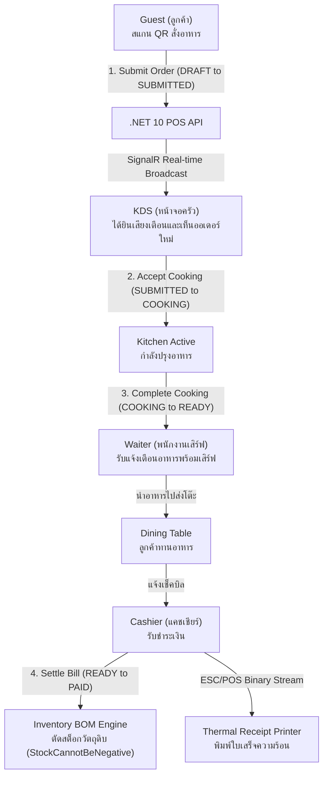

# 01_POS_KDS_ENGINE: Smart POS & Kitchen Display System

ระบบ Point of Sale (POS) และ Kitchen Display System (KDS) แบบ Real-time ที่ออกแบบมาสำหรับธุรกิจร้านอาหารและค้าปลีกยุคใหม่ พร้อมระบบตัดสต็อกสูตรอาหาร (Bill of Materials - BOM) อัตโนมัติ และการเชื่อมต่อเครื่องพิมพ์ใบเสร็จความร้อน (ESC/POS) โดยตรง

---

## 🔄 ภาพรวม Workflow การทำงาน (Business & Technical Workflow)

ระบบแบ่งออกเป็น 4 ผู้ใช้งานหลัก (Actors) ที่ทำงานประสานกันผ่าน SignalR Real-time Hub:



### รายละเอียดขั้นตอนการเปลี่ยนสถานะ (State Transitions):
1. **`DRAFT ➔ SUBMITTED` (Trigger: `SUBMIT_ORDER`)**: ลูกค้าหรือพนักงานกดส่งรายการอาหาร ระบบทำการ Snapshot ราคาสินค้า ณ เวลานั้น และ Broadcast Event ไปยังจอ KDS ในครัวทันที
2. **`SUBMITTED ➔ COOKING` (Trigger: `ACCEPT_COOKING`)**: เชฟในครัวกดรับออเดอร์ บันทึกเวลาเริ่มทำอาหารเพื่อใช้วัด SLA ในครัว
3. **`COOKING ➔ READY` (Trigger: `ORDER_READY`)**: เชฟทำอาหารเสร็จและกดพร้อมเสิร์ฟ ระบบส่งสัญญาณ Real-time ไปเตือนที่หน้าจอพนักงานเสิร์ฟ
4. **`READY ➔ PAID` (Trigger: `SETTLE_BILL`)**: แคชเชียร์รับเงิน (PromptPay QR / เงินสด / บัตร) ระบบจะทำการ:
   - ตรวจสอบและตัดสต็อกวัตถุดิบตามสูตรอาหาร (BOM)
   - ล็อกราคาสินค้าไม่ให้ถูกแก้ไขย้อนหลัง
   - สั่งพิมพ์ใบเสร็จผ่านคำสั่ง ESC/POS Binary ไปยังเครื่องพิมพ์ความร้อน

---

## 🛡️ กฎเหล็กของระบบ (Domain Invariants)

1. **`StockCannotBeNegative` (สต็อกวัตถุดิบห้ามติดลบ)**:
   - ป้องกันไม่ให้การขายสินค้าตัดวัตถุดิบจนติดลบ หากสต็อกไม่พอระบบจะ Reject ทันทีเพื่อป้องกันปัญหาต้นทุนและสต็อกผิดพลาด
2. **`PriceImmutableAfterCheckout` (ราคาสินค้าห้ามเปลี่ยนหลังเช็คเอาท์)**:
   - เมื่อออเดอร์ถูกสร้างและยืนยันแล้ว ราคาต่อหน่วย (Unit Price) จะถูก Snapshot ไว้ถาวร แม้ผู้จัดการจะเปลี่ยนราคาสินค้าใน Master Data ในภายหลัง รายการย้อนหลังจะไม่ได้รับผลกระทบ

---

## 💻 Tech Stack & เหตุผลในการเลือกใช้

| ส่วนประกอบ | เทคโนโลยีที่เลือก | เหตุผลที่เลือก | ข้อดีหลัก (Advantages) |
|---|---|---|---|
| **Frontend UI** | **Next.js 16 + React 19** | รองรับ SSR/SSG ประสิทธิภาพสูง เรนเดอร์รวดเร็ว | ผู้ใช้เปิดหน้าเว็บสั่งอาหารได้ทันที ไม่กระตุก รองรับทั้งมือถือและแท็บเล็ต |
| **Offline-First DB** | **Dexie.js (IndexedDB)** | จัดเก็บแคชเมนูและออเดอร์บนอุปกรณ์ของเครื่อง POS ท้องถิ่น | แคชเชียร์ยังสามารถทำงานและบันทึกออเดอร์ได้ต่อเนื่องแม้เน็ตจะหลุดชั่วคราว |
| **Audio Notification**| **Web Audio API** | สังเคราะห์เสียงเตือน Chime/Beep ในเบราว์เซอร์โดยไม่ต้องโหลดไฟล์เสียงภายนอก | เสียงเตือนในครัวทำงานได้ 100% ไม่มีดีเลย์ ไม่เปลืองแบนด์วิดท์ |
| **Backend API** | **.NET 10 (C#)** | Minimal APIs ประสิทธิภาพระดับสูงสุด Low Memory Footprint | ประมวลผลธุรกรรมได้นับหมื่นรายการต่อวินาที ปลอดภัย Type-safe สูง |
| **Real-time Engine** | **SignalR Core** | สื่อสารสองทางผ่าน WebSocket แบบ Low-latency | จอ KDS ในครัวและจอพนักงานเสิร์ฟอัปเดตสถานะทันทีภายในเสี้ยววินาที |
| **Hardware Printing** | **ESC/POS Binary Stream**| สื่อสารกับเครื่องพิมพ์ใบเสร็จมาตรฐานอุตสาหกรรม (Epson, Star, Xprinter) | ควบคุมการตัดกระดาษ (`GS V 0`), ขนาดฟอนต์, และบาร์โค้ดได้แม่นยำ ไม่ต้องพึ่งไดรเวอร์ภายนอก |

---

## 🚀 วิธีการรันระบบ (Quick Start)

### 1. รัน Backend API:
```powershell
cd pos-api
dotnet run
```
> API พร้อมทำงานที่: `http://localhost:5000`

### 2. รัน Frontend Web:
```powershell
cd pos-web
bun run dev
```
> เข้าใช้งานได้ที่: `http://localhost:3000`
